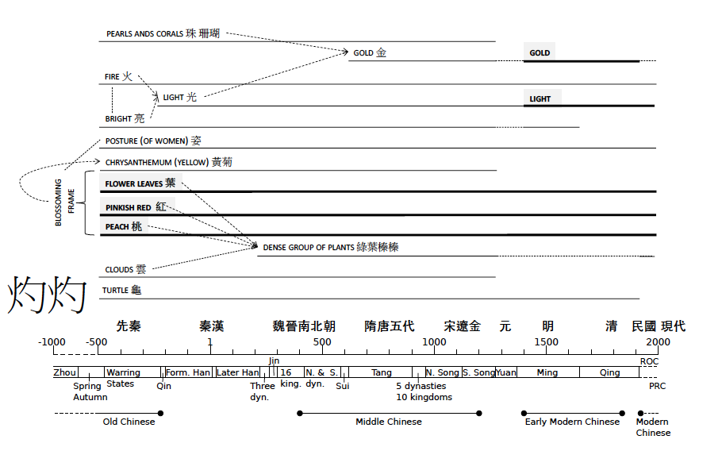

```{r setup, include=FALSE}
knitr::opts_chunk$set(echo = TRUE)
```

```{r}
library(tidyverse)
library(plotly)
```

```{r}
PATH = "./diachroniczhuozhuo"
files <- list.files(path = PATH,
                    #pattern = sprintf('*%s.txt', "_"), 
                    full.names = TRUE
                    )

files
```

Combine all of these in 1 dataframe
```{r}
zhuozhuocombined <- function(csvfile){
  
    df <- read_csv(csvfile) %>%
      mutate(ideo = str_extract(csvfile, ".._"),
             ideo = str_replace(ideo, "_", ""),
             period = str_extract(csvfile, "_.+\\.csv"),
             period = str_replace(period, "_", ""),
             period = str_replace(period, "\\.csv", "")) %>%
      rename(collocate = item1)
    
    #df
    
    #write_csv(df, "zhuozhuocombined.csv", append = T, col_names = TRUE)
}

map(files, zhuozhuocombined)
```

```{r}
db <- read_csv("zhuozhuocombined.csv") %>%
  filter(! period == "period")

db$period <- factor(db$period,
                           levels = c('xianqin', 
                                      'qinhan', 
                                      'weijin',
                                      'suitang', 
                                      'songjin', 
                                      'yuan', 
                                      'ming', 
                                      'qing', 
                                      'minguo',
                                      'modern'))

db
```

# Plotting

```{r}
db %>%
  arrange(desc(value)) %>%
  ggplot(aes(x = period, y = value)) +
  geom_point() +
  geom_text(aes(label = collocate), family="Noto Sans CJK TC") 
```

As we can see 灼灼's highest collocate is itself, which is normal with the method we have used.
Let us filter those out, as well as Chinese punctuation (。，；“”), and look at attraction > 0.03.

```{r}
zoom1 <- db %>%
  arrange(desc(value)) %>%
  filter(! collocate == "灼灼") %>%
  filter(! collocate == "。") %>%
  filter(! collocate == "，") %>%
  filter(! collocate == "；") %>%
  filter(! collocate == "“") %>%
  filter(! collocate == "”") %>%
  filter(! collocate == "」") %>%
  filter(value > 0.025) %>%
  ggplot(aes(x = period, y = value)) +
  geom_point() +
  geom_text(aes(label = collocate), family="Noto Sans CJK TC") 

ggplotly(zoom1)
```


Compared to original




```{r}
db %>%
  #arrange(desc(value)) %>%
  filter(! collocate == "灼灼") %>%
  filter(! collocate == "。") %>%
  filter(! collocate == "，") %>%
  filter(! collocate == "；") %>%
  filter(! collocate == "“") %>%
  filter(! collocate == "”") %>%
  filter(! collocate == "」") %>%
  filter(! collocate == "目光") %>%
  mutate(highlight = 
           case_when(str_detect(collocate, "[夭金光火珠珊瑚亮姿黃菊華紅綠蓁雲鬼]") ~ "in original", 
    TRUE ~ "not in original")) %>%
  filter(value > 0.025) %>%
  ggplot(aes(x = period, y = value)) +
  #geom_point() +
  theme_classic() +
  geom_text(aes(label = collocate, color = highlight
                ), 
            family="Noto Sans CJK TC") +
  scale_color_manual(values=c("darkblue", "#999999")) +
  theme(legend.title = element_blank(),
        legend.position = "bottom") +
  ggtitle("Scatter plot") +
  ylab("measure of similarity") +
  theme(plot.title = element_text(hjust=-0)) 
```


# Per period top list

```{r}
db %>%
  filter(period == "suitang") %>%
  filter(! collocate == "灼灼") %>%
  filter(! collocate == "。") %>%
  filter(! collocate == "，") %>%
  filter(! collocate == "；") %>%
  filter(! collocate == "“") %>%
  filter(! collocate == "”") %>%
  filter(! collocate == "」") %>%
  top_n(20, abs(value)) %>%
  ggplot(aes(x = reorder(collocate, value), y = value)) +
  geom_bar(stat = "identity") +
  coord_flip() +
  theme(text = element_text(family="Noto Sans CJK TC")) 
```


```{r}
db %>%
  filter(period == "suitang") %>%
  filter(! collocate == "灼灼") %>%
  filter(! collocate == "。") %>%
  filter(! collocate == "，") %>%
  filter(! collocate == "；") %>%
  filter(! collocate == "“") %>%
  filter(! collocate == "」") %>%
  filter(! collocate == "”") %>%
  top_n(100, abs(value)) #%>%
```


```{r}
db %>%
  filter(period == "weijin") %>%
  filter(! collocate == "灼灼") %>%
  filter(! collocate == "。") %>%
  filter(! collocate == "，") %>%
  filter(! collocate == "；") %>%
  filter(! collocate == "“") %>%
  filter(! collocate == "」") %>%
  filter(! collocate == "”") %>%
  top_n(30, abs(value)) #%>%
```


```{r}
db %>%
  filter(period == "qing") %>%
  filter(! collocate == "灼灼") %>%
  filter(! collocate == "。") %>%
  filter(! collocate == "，") %>%
  filter(! collocate == "；") %>%
  filter(! collocate == "“") %>%
  filter(! collocate == "」") %>%
  filter(! collocate == "”") %>%
  top_n(30, abs(value)) #%>%
```


```{r}
db %>%
  filter(period == "modern") %>%
  filter(! collocate == "灼灼") %>%
  filter(! collocate == "。") %>%
  filter(! collocate == "，") %>%
  filter(! collocate == "；") %>%
  filter(! collocate == "“") %>%
  filter(! collocate == "」") %>%
  filter(! collocate == "”") %>%
  top_n(30, abs(value)) #%>%
```
